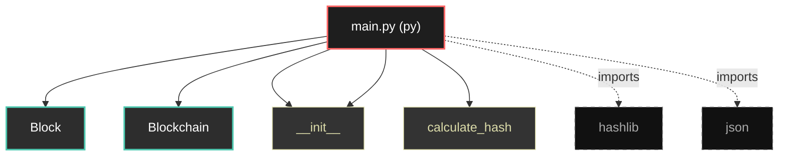
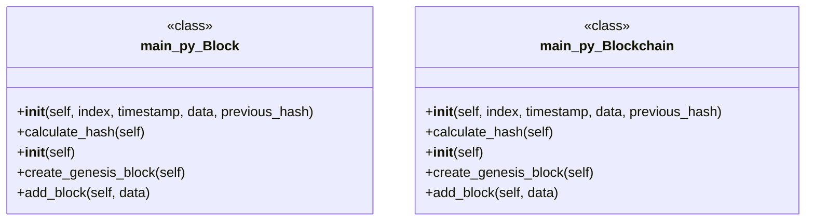

# Polyglot Codebase Knowledge Graph

> Generated offline by **readmenator**. 1 files, 7 symbols, 2 imports. Supports C, C++, Python, Go, Rust, JS/TS, Java, C#, Shell, PHP, Dart, GDScript, Nim, ASM, Ruby, Swift, Kotlin, Scala, Lua, Elixir.
> No LLMs. No tokens. Pure static analysis. See more [here](https://github.com/grisuno/ReadMenator)

**Start here:** Statistics Dashboard for scope, God Nodes for blast radius, Architecture Reference for per-file API. Agents: prefer `readmenator-agent/INDEX.md` + `SYMBOLS.md`.

**Wiki:** prefer `readmenator-wiki/index.md` for progressive disclosure: one synthesis page per community, `connections.json` with EXTRACTED vs INFERRED confidence, `queries.md` log, `REPORT.md` audit.

**Confidence:** EXTRACTED = parsed from source, INFERRED = heuristic bridge, AMBIGUOUS = reported, never hidden. See `readmenator-wiki/REPORT.md`.

**Total Files Parsed:** 1 | **Total Symbols Extracted:** 7 | **Total Imports:** 2

<!-- ranking_model: v1.0 | weights: {ppr:0.45,auth:0.2,test:0.15,doc:0.1,fresh:0.1} | alpha:0.85 | commit:05a4468 | date:2026-07-18 -->


## Table of Contents

1. [Statistics Dashboard](#statistics-dashboard)
2. [Architectural Layers](#architectural-layers)
3. [Ranked Context](#ranked-context)
4. [God Nodes](#god-nodes)
5. [Suggested Questions](#suggested-questions)
6. [Hotspot Analysis](#hotspot-analysis)
7. [Change Impact Analysis](#change-impact-analysis)
8. [Suggested Linting Rules](#suggested-linting-rules)
9. [Orphans](#orphans)
10. [Query Recipes](#query-recipes)
11. [Structural Knowledge Map](#structural-knowledge-map)
12. [UML Class Diagram](#uml-class-diagram)
13. [Code Property Graph](#code-property-graph)
14. [Architecture Reference](#architecture-reference)
    - [PY (1 files)](#py-1-files)

---

## Statistics Dashboard

| Metric | Value |
|--------|-------|
| Total Files | 1 |
| Total Symbols | 7 |
| Total Imports | 2 |
| Call Edges | 13 |
| Inheritance Edges | 0 |
| Languages | 1 |
| Avg Symbols/File | 7.0 |
| Avg Imports/File | 2.0 |

### Top Files by Import Count (Fan-Out)

| File | Imports | Symbols | Language |
|------|---------|---------|----------|
| `main.py` | 2 | 7 | py |

---

## Architectural Layers

Auto-detected from path patterns, naming conventions, and imported frameworks.

| Layer | Files |
|-------|-------|
| utility | 1 |

### utility

- `main.py` (py, 7 symbols)

---

## Ranked Context

Files ranked by composite score for the current query context. The ranking combines Personalized PageRank (query relevance), global authority, test coverage, documentation coverage, and code freshness. Model: v1.0.

| Rank | File | Composite | PPR | Authority | Test | Doc |
|------|------|-----------|-----|-----------|------|-----|
| 1 | `main.py` | 0.0000 | 0.0000 | 0.0000 | 0.00 | 0.00 |

---

## God Nodes

Most architecturally central files ranked by combined import/export degree and symbol richness.

| File | Score | Connections | PageRank |
|------|-------|-------------|----------|
| `main.py` | 0.7 | | 0.0000 |

---

## Suggested Questions

Auto-generated exploration prompts based on graph structure:

- What does main.py depend on, and what depends on it? (0 connections)
- What is Block in main.py and how is it used?
- What is the overall architecture of this codebase?

---

## Hotspot Analysis

Files ranked by combined complexity (symbol count) and centrality (connection count). High-scoring files are architecturally critical and may need refactoring attention.

| File | Complexity | Centrality | Combined | Symbols | Connections |
|------|-----------|------------|----------|---------|-------------|
| `main.py` | 1.000 | 1.000 | 1.000 | 7 | 2 |

---

## Change Impact Analysis

Files sorted by how many other files would be affected if they changed. High-impact files should be changed with caution.

| File | Direct Dependents | Transitive Dependents | Total Impact |
|------|------------------|----------------------|--------------|
| `main.py` | 0 | 0 | 0 |

---

## Suggested Linting Rules

Automatically suggested linting and security rules based on patterns detected in the codebase. These can be exported as Semgrep rules using the `--export-rules` flag.

| Rule ID | Severity | Description | Language | Matches |
|---------|----------|-------------|----------|---------|
| `RM001` | info | Large number of functions in py: 5 total | py | 5 |

---

## Orphans

Files with no documentation or low connectivity. These are candidates for documentation investment or cleanup.

- `main.py` (7 symbols, no doc)

---

## Query Recipes

Example queries you can run against this knowledge base using the ranking engine:

```
# Find files most relevant to a concept
readmenator query "Where is the import resolver implemented?"

# Rank files by relevance to a topic
readmenator query "How does documentation generation work?"

# Explain why a file ranks highly
readmenator query "explain readmenator/_documentation.py"

# Trace dependency paths with ranked context
readmenator query "path from CLI to exporter"
```

The ranking model uses the following signals:

- **Personalized PageRank** (45% weight): query-specific relevance via seed propagation
- **Global Authority** (20% weight): structural importance via standard PageRank
- **Test Coverage** (15% weight): fraction of symbols referenced in test files
- **Doc Coverage** (10% weight): presence of docstrings and file-level docs
- **Freshness** (10% weight): recent modification activity

Results include score decomposition and justification paths for each ranked item.

---

## Structural Knowledge Map



---

## UML Class Diagram

Auto-generated Mermaid class diagram from parsed class-level symbols. Shows classes, structs, interfaces, traits, and their methods with inheritance and dependency relationships.



---

## Code Property Graph

Machine-readable Code Property Graph (CPG) in JSON-LD format. This block allows AI agents to parse the full structural graph without additional file reads. Compatible with GraphRAG pipelines.

```json
{"@context": "https://schema.org", "analysis": {"communities": [], "god_nodes": [{"node_id": "main.py", "score": 0.7}], "surprising_connections": []}, "edges": [{"confidence": "EXTRACTED", "relation": "imports", "source": "main.py", "target": "hashlib"}, {"confidence": "EXTRACTED", "relation": "imports", "source": "main.py", "target": "json"}], "generator": "readmenator", "metadata": {"edge_count": 15, "file_count": 1, "language_count": 1, "symbol_count": 7}, "nodes": [{"id": "main.py", "kind": "module", "label": "main.py", "language": "py", "sha256": "b29a6183ffeba1b1", "symbol_count": 7, "symbols": [{"kind": "class", "line": 4, "name": "Block", "signature": "class Block"}, {"kind": "class", "line": 16, "name": "Blockchain", "signature": "class Blockchain"}, {"kind": "method", "line": 5, "name": "__init__", "signature": "def __init__(self, index, timestamp, data, previous_hash)"}, {"kind": "method", "line": 12, "name": "calculate_hash", "signature": "def calculate_hash(self)"}, {"kind": "method", "line": 17, "name": "__init__", "signature": "def __init__(self)"}, {"kind": "method", "line": 21, "name": "create_genesis_block", "signature": "def create_genesis_block(self)"}, {"kind": "method", "line": 25, "name": "add_block", "signature": "def add_block(self, data)"}]}], "type": "CodePropertyGraph", "version": "1.0"}
```

---

## Architecture Reference

### PY (1 files)

#### `main.py`
**Path:** `main.py`

**Classes:**
- `Block` (line 4) `class Block`
- `Blockchain` (line 16) `class Blockchain`

**Methods:**
- `__init__` (line 5) `def __init__(self, index, timestamp, data, previous_hash)`
- `calculate_hash` (line 12) `def calculate_hash(self)`
- `__init__` (line 17) `def __init__(self)`
- `create_genesis_block` (line 21) `def create_genesis_block(self)`
- `add_block` (line 25) `def add_block(self, data)`
