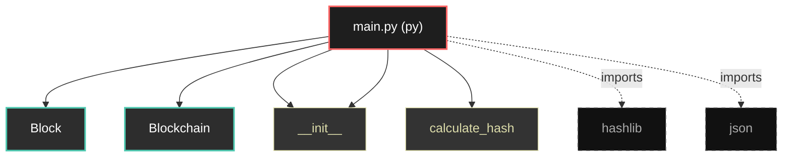

# Polyglot Codebase Knowledge Graph

> Generated offline by **readmenator**. Supports C, C++, Python, Go, Rust, JS/TS, Java, C#, Shell, PHP, Dart, GDScript, Nim, ASM.
> No LLMs. No tokens. Pure static analysis. See more [here](https://github.com/grisuno/ReadMenator)

**Total Files Parsed:** 1 | **Total Symbols Extracted:** 7 | **Total Imports:** 2

## Structural Knowledge Map

---

## Architecture Reference

### PY (1 files)

#### `main.py`
**Path:** `main.py`

**Classes:**
- `Block` (line 4) `class Block`
- `Blockchain` (line 16) `class Blockchain`

**Functions:**
- `__init__` (line 5) `def __init__(self, index, timestamp, data, previous_hash)`
- `calculate_hash` (line 12) `def calculate_hash(self)`
- `__init__` (line 17) `def __init__(self)`
- `create_genesis_block` (line 21) `def create_genesis_block(self)`
- `add_block` (line 25) `def add_block(self, data)`
